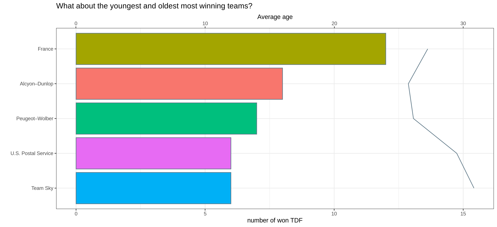

Tidytuesday 😄
=============

My weekly commits for the tidytuesday project
---------------------------------------------

I’ve discovered this challenge during another challenge :) the
\#100DaysOfCode challenge. i’ve started during March 2020 quarantine for
covid19. Hope one day will look back at these days and find a reason to
smile and be happy about what i’ve accomplished.

### Year 2020 Episode 15: Tour de France

I don’t know shit about Tour De France. Very very bad, i agree. In fact,
one of my first questions to address was actually discover why i’m so
uninterested in this sport. Too boring? too low profile? Does it depend
on the geographical area where i was born? In the end i’ve just (badly)
plotted the age of the most winning teams.. Interesting? Well, it still
demonstrates that 30+ doesnt mean you’re done.

### Year 2020 Episode 16: BBC - Survey - HipHop

This was a cool one. All of us love music right? I enjoyed digging into
this dataset from BBC where a bunch of critics were asked what was their
HipHop top 5 personal rank of all time. After a week of r4ds studying,
youtube screencasts, i’ve actually learned what are the basic steps to
*easily* handle and explore a dataset. As DR says: “Always start
exploring the categorical variables with some counting”. After that it
comes naturally to focus on some of them, summarize, and search for
relationships between each other. Here, it was clear that the most voted
songs belong to the 90s and the level has been decreasing since then.
That’s embarassing but i’ve no idea about who Public Enemy is!!

### Year 2020 Episode 16: BBC - Survey - HipHop - followup

I was not satisfied with my plots. For several reasons:  
\* There are two plots and not one \* I’m kind of tired to show in the
same plot a lot of information. What do you want to accomplish? This is
not a scientific paper. That’s direct communication. \* I didn’t like
the time on the y-axis, it makes it kind of weird So im showing here the
main (obvious?) message extracted from the data.  
**important**: I’ve read the code of i think about the ~80% of the
\#tidytuesday plots i’ve seen. That was so instructive.

